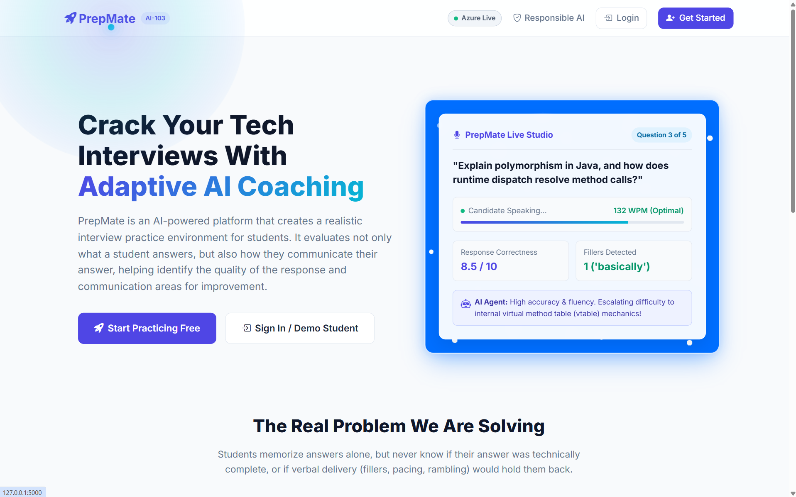
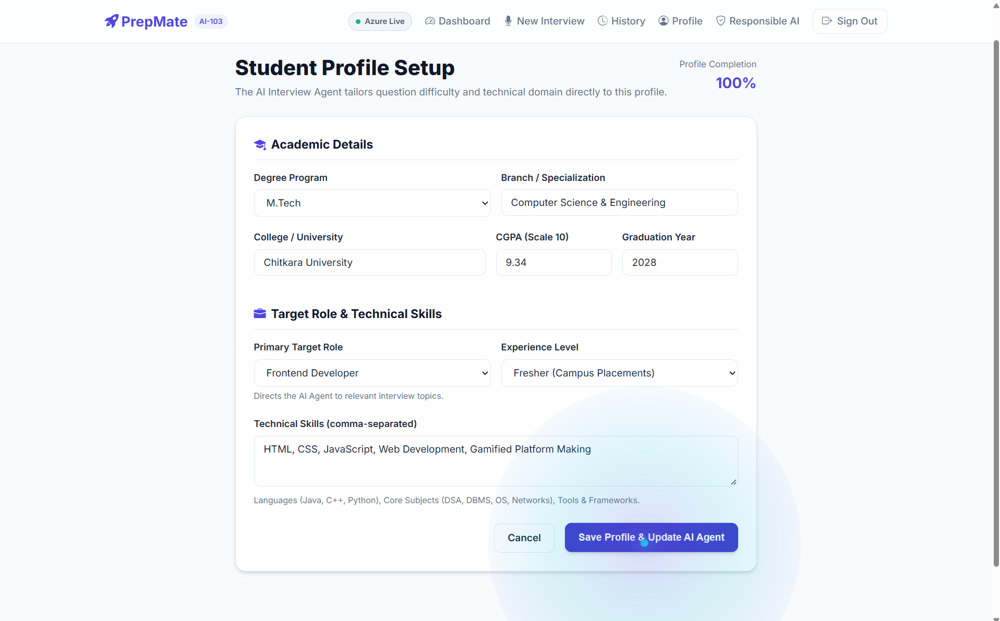
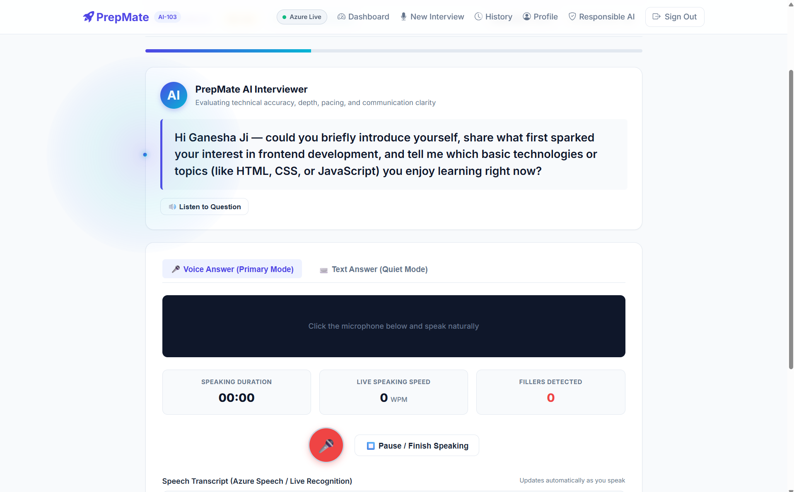
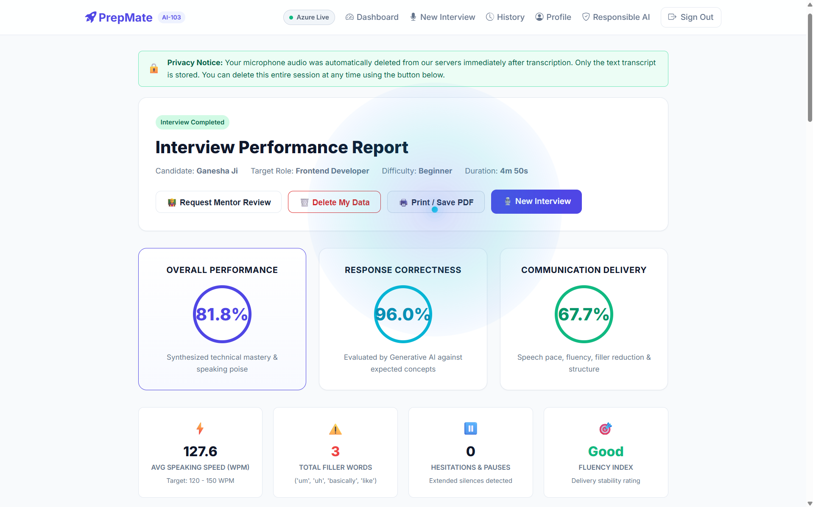
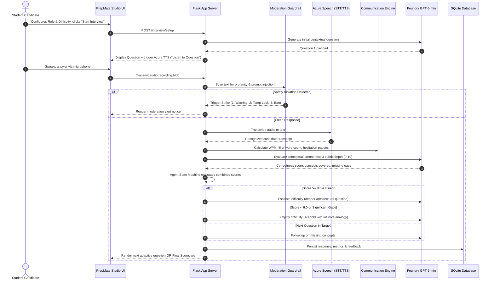

# 🚀 PrepMate: AI-Powered Response & Communication Coach
> **Chitkara University | Department of Computer Science & Engineering (CSE-AIML)**  
> **INBIOT AI-103 Group Project**

[](https://www.python.org/)
[](https://flask.palletsprojects.com/)
[](https://azure.microsoft.com/en-us/products/ai-services/ai-speech)
[](https://ai.azure.com/)
[](tests/)
[](templates/responsible_ai.html)
[](LICENSE)

---

## 👥 Project Title & Team Members

* **Project Title:** PrepMate – AI-Powered Response & Communication Coach
* **Course:** INBIOT AI-103 Group Project
* **Institution:** Chitkara University, Punjab
* **Department:** Computer Science & Engineering (AIML)

| # | Team Member Name | Roll Number |
| **1.** | **Gurumeet Saini** | `2410992521` | (Team Leader)
| **2.** | **Amneet Kaur** | `2410992674` |
| **3.** | **Aman Saini** | `2410992672` |
| **4.** | **Sneha Gumber** | `2410992635` |
| **5.** | **Kapil** | `2410992781` |

---

## 📌 Problem Statement & Solution Overview

### The Real Problem
Many students know the technical answers but struggle to explain them clearly and confidently during interviews. They may also face difficulties with fluency, speaking pace, and managing pauses.
In traditional interview practice, students often receive limited feedback on how they answered, and the next question does not always adapt to their performance. This makes it difficult to identify their specific strengths and weaknesses.

### The PrepMate Solution
PrepMate addresses this by providing an AI-driven mock interview that evaluates both response correctness and communication skills, then provides personalized feedback to help students improve.

To solve this problem, PrepMate combines multiple AI technologies into one connected workflow.

We use **Microsoft Foundry** with **GPT-5-mini** to generate role-specific interview questions and evaluate the student's responses.

Our **AI-powered interview logic** uses the interview context and performance results to generate relevant follow-up questions and adjust the interview flow, making it more adaptive rather than fixed.

We use **Azure AI Speech** for voice interaction. Speech-to-Text converts the student's spoken answer into text for analysis, while Text-to-Speech can make the AI interviewer speak naturally.

The system combines response correctness and communication analysis to provide personalized coaching.

For the supporting system, we use **Python and Flask for the backend, HTML, CSS and JavaScript for the frontend, and SQLite for data management.**

---

## 📸 Platform Previews & Screenshots

> *Add your platform screenshots to the `docs/images/` directory to display them below.*

| PrepMate Live Studio (Homepage) | Student Profile Setup |
| :---: | :---: |
|  |  |
| *Starry Blue Glassmorphic UI with Interactive Cursor Glow* | *Clean UI without prefilled dummy data* |

| Live Voice Interview Room | Performance Scorecard & Analytics |
| :---: | :---: |
|  |  |
| *Real-time Web Audio Waveform & Adaptive AI Agent* | *Dual Metrics, Concepts Covered/Gaps & Mentor Review* |

---

## 🏛️ Solution Architecture & Data Flow

PrepMate follows a modular multi-tier architecture uniting speech processing, generative intelligence, agent decision orchestration, and relational persistence.

### 1. High-Level System Architecture

```mermaid
flowchart TD
    subgraph Client["Client Browser (Responsive HTML5 / CSS3 / Vanilla JS)"]
        UI["Interview Studio UI & Glassmorphic HUD"]
        Mic["Microphone / Web Audio API"]
        Wave["HTML5 Canvas Waveform Visualizer"]
        Cursor["Interactive Ambient Cursor Glow & 3D Tilt"]
    end

    subgraph FlaskApp["Flask Application Backend (Python 3.12)"]
        AuthBP["Auth & Profile Blueprints"]
        InterviewBP["Interview Blueprint & Lifecycle Controller"]
        SpeechSvc["SpeechService (Azure Speech SDK & Audio Buffer)"]
        CommSvc["CommunicationService (WPM, Fillers, Pauses)"]
        AgentSvc["AIAgentService (Adaptive State Orchestrator)"]
        ModSvc["ModerationService (3-Strike Safety Policy)"]
        ReviewSvc["ReviewService (Mentor Contest Workflow)"]
        CoachSvc["CoachService (Daily Micro-Drills)"]
    end

    subgraph CloudAI["Microsoft Azure AI Services (Live Mode)"]
        AzureSTT["Azure AI Speech-to-Text (STT)"]
        AzureTTS["Azure AI Text-to-Speech (TTS - en-US-JennyNeural)"]
        Foundry["Microsoft Foundry / Azure OpenAI (GPT-5-mini)"]
    end

    subgraph FallbackEngine["Intelligent Local Fallback Engine (Offline Mode)"]
        LocalNLP["Heuristic Synonym & Concept Scorer"]
        LocalQGen["Adaptive Rule-Based Question Bank"]
        WebSpeech["Browser Web Speech API"]
    end

    subgraph Database["Relational Persistence (SQLite + SQLAlchemy)"]
        UsersDB[("Users & Clean Profiles")]
        SessionsDB[("Interview Sessions & History")]
        QADB[("Questions, Answers & AI Feedback")]
        ReviewDB[("Mentor Review Requests & Audits")]
    end

    Mic -->|Audio Blob| SpeechSvc
    Mic -->|Live Stream| Wave
    SpeechSvc -->|Primary| AzureSTT
    SpeechSvc -.->|Offline Fallback| WebSpeech
    InterviewBP --> ModSvc
    ModSvc -->|Validated Content| AgentSvc
    AgentSvc -->|Primary| Foundry
    AgentSvc -.->|Offline Fallback| LocalNLP
    InterviewBP --> CommSvc
    InterviewBP --> Database
    ReviewSvc --> ReviewDB
    AgentSvc -->|Dynamic Follow-up / Report| UI
```



### 2. End-to-End Interview Data Flow & Agent Decision Loop



---

## 🛠️ Technology Stack & AI Components

| Layer | Technologies / Services | Purpose |
| :--- | :--- | :--- |
| **Generative AI** | **Microsoft Foundry / Azure OpenAI (`gpt-5-mini`)** | Evaluates technical accuracy, rubric scoring (0–10 scale), identifies concept gaps, and synthesizes dynamic follow-up questions. |
| **Speech Processing** | **Azure AI Speech Services** | Real-time Speech-to-Text (STT) for microphone input; Text-to-Speech (TTS) using `en-US-JennyNeural` voice for conversational audio playback. |
| **Communication Engine** | **Python Speech Analytics** | Computes real-time Words Per Minute (WPM), isolates filler words (`um`, `uh`, `basically`, `like`, `you know`), and scores structural clarity. |
| **Dual-Mode Engine** | **Hybrid Cloud / Local Heuristic** | Automatically falls back to an offline concept-synonym heuristic engine if cloud keys are not loaded, ensuring 100% demo uptime. |
| **Content Moderation** | **3-Strike Moderation Service** | Guards against profanity, hate speech, and LLM prompt injection (`Ignore previous instructions`) with progressive strikes. |
| **Human Oversight** | **Mentor Review Service** | Enables candidates to contest an AI score for formal human professor review and score adjustments. |
| **Backend Framework** | **Python 3.12, Flask 3.1, Jinja2** | Lightweight, modular blueprint-based application architecture. |
| **Database & ORM** | **SQLite 3, Flask-SQLAlchemy 3.1** | Session tracking, clean profile persistence, and audit logging. |
| **Frontend & UI** | **HTML5, Modern CSS3, Vanilla JS** | Fully responsive layout across desktop, tablet, and mobile; interactive ambient cursor glow; 3D perspective card tilt; HTML5 Canvas audio waveform. |
| **Iconography** | **Bootstrap Icons 1.11.3 (CDN)** | Professional, accessible vector icons replacing informal emojis across all navigation and cards. |

---

## 🛡️ Responsible AI Framework (Microsoft 6 Core Principles)

PrepMate is architected in direct compliance with **Microsoft’s Six Core Principles of Responsible AI**:

```
                  ┌─────────────────────────────────────────┐
                  │    MICROSOFT RESPONSIBLE AI PRINCIPLES  │
                  └─────────────────────────────────────────┘
                       │           │           │
        ┌──────────────┴───┐ ┌─────┴─────┐ ┌───┴──────────────┐
        │ 1. FAIRNESS      │ │ 2. SAFETY │ │ 3. PRIVACY       │
        │ Accent-neutral   │ │ 3-Strike  │ │ Ephemeral audio  │
        │ rubric scoring   │ │ filter    │ │ Right to Forget  │
        └──────────────────┘ └───────────┘ └──────────────────┘
                       │           │           │
        ┌──────────────┴───┐ ┌─────┴─────┐ ┌───┴──────────────┐
        │ 4. INCLUSIVENESS │ │ 5. TRANSP.│ │ 6. ACCOUNTABILITY│
        │ Voice & typed    │ │ 0-10 item │ │ Request Mentor   │
        │ answer modes     │ │ breakdown │ │ Review mechanism │
        └──────────────────┘ └───────────┘ └──────────────────┘
```

1. **Fairness (Accent-Neutral & Dialect-Fair):** The scoring rubric evaluates conceptual comprehension, not regional pronunciation, native phrasing, or vocabulary choice. A student saying *"memory that does not wipe when powered off"* earns full credit alongside *"persistent non-volatile secondary storage"*.
2. **Reliability & Safety:** Our dual-mode architecture guarantees zero-downtime during high-stakes presentations via an automatic local heuristic fallback engine. The **3-Strike Content Moderation Policy** defends the platform against abusive input and prompt injection.
3. **Privacy & Security:** Voice recordings are strictly **ephemeral** and purged from memory immediately following transcription. Students retain full control under the *"Right to be Forgotten"*, with a **"Delete My Data"** button to permanently remove sessions. Passwords use PBKDF2-SHA256 hashing.
4. **Inclusiveness & Accessibility:** Candidates can switch between Voice Input and a quiet **Typed Answer Mode** (ideal for noisy campus labs or candidates with speech impairments). Questions can also be read aloud via Text-to-Speech.
5. **Transparency & Explainability:** Every evaluation provides an itemized score breakdown across technical correctness (0.0 to 10.0 rubric), speaking rate (WPM), filler counts, specific concepts covered, missing knowledge gaps, and an official canonical model answer.
6. **Accountability & Human Oversight:** AI scores are advisory coaching indicators—not automated rejection decisions. Students can click **"Request Mentor Review"** on any scorecard to flag an answer for human professor review and manual score override.

*A live interactive review of these principles is available on the platform at `/responsible-ai`.*

---

## 🚀 Setup & Installation Instructions

### Prerequisites
* **Python 3.12+** installed on your system.
* **Git** installed.
* Microphone and a modern web browser (Google Chrome, Microsoft Edge, Mozilla Firefox, or Safari).

### 1. Clone the Repository
```powershell
git clone https://github.com/your-org/PrepMate.git
cd PrepMate
```

### 2. Create & Activate a Virtual Environment
```powershell
# Windows (PowerShell)
python -m venv venv
.\venv\Scripts\Activate.ps1

# macOS / Linux
python3 -m venv venv
source venv/bin/activate
```

### 3. Install Dependencies
```powershell
pip install -r requirements.txt
```

### 4. Configure Environment Variables
Copy the `.env.example` template to `.env`:
```powershell
copy .env.example .env      # Windows PowerShell
cp .env.example .env        # macOS / Linux
```

Edit `.env` with your Azure credentials (or leave blank to automatically run in **Intelligent Local Fallback Mode**):
```

Flask Secrets

Microsoft Azure AI Speech (Optional: Leave blank for Fallback Mode)

Microsoft Foundry / Azure OpenAI (Optional: Leave blank for Fallback Mode)
```

> **Zero-Config Notice:** If no Azure API keys are specified, PrepMate runs in **Intelligent Fallback Mode**, allowing full evaluation, speech transcription via browser Web Speech API, and adaptive transitions out of the box with zero external dependencies.

### 5. Launch the Application
```powershell
python app.py
```
Open your browser to: **`http://127.0.0.1:5000`**

### 6. Pre-Seeded Demo Account
For rapid testing without registration, log in using:
* **Email:** `student@chitkara.edu.in`
* **Password:** `password123`

---

## 🧪 Testing & Verification Results

PrepMate includes a comprehensive automated test suite built with `pytest`:

```powershell
python -m pytest tests/ -v
```

### Standardized Rubric Matrix

| Score Range | Category | Evaluative Criteria |
| :---: | :---: | :--- |
| **8.5 – 10.0** | **Advanced / Exemplary** | Clear conceptual mastery, structured explanation, and mechanisms/trade-offs explained. |
| **7.0 – 8.4** | **Proficient / Solid** | Accurate response covering all core points; understandable without relying heavily on jargon. |
| **5.5 – 6.9** | **Developing / Basic** | Partial correctness; core idea identified but missing depth, edge cases, or key terminology. |
| **3.5 – 5.4** | **Emerging / Limited** | Noticeable conceptual misconceptions, vague generalities, or incomplete explanation. |
| **0.0 – 3.4** | **Unsatisfactory / Off-topic** | Incorrect explanation, off-topic ramble, or answer left unattempted. |

---

## 🔮 Known Limitations & Future Improvements

### Current Limitations
1. **Acoustic Noise Sensitivity:** In noisy university computer labs or cafeteria environments, ambient chatter can degrade Speech-to-Text transcription accuracy.
2. **Domain-Specific Slang & Jargon:** Highly specialized library names or syntax abbreviations (e.g., `kubectl`, `async/await`) may occasionally be transcribed phonetically by default speech models.
3. **Hardware Variations:** Candidate microphone sensitivity and browser permissions vary widely across consumer laptops and smartphones.

### Future Roadmap
* **Multilingual Interviewing:** Incorporate Azure Speech translation models to support practice in regional Indian languages (Hindi, Punjabi) for bilingual candidates transitioning into English.
* **Multimodal Computer Vision Analysis:** Integrate Azure AI Vision to evaluate non-verbal cues (eye contact, posture, nervous fidgeting, smile frequency) via webcam with explicit student consent.
* **Resume-Driven Question Customization:** Enable students to upload their PDF resumes; our GenAI agent will extract project experiences and challenge them on their exact GitHub repositories.
* **Institutional Placement Portal:** Add a professor dashboard allowing university placement coordinators to track cohort performance analytics, contest reviews, and student growth trajectories.

---

## 📚 Acknowledgments & Third-Party Resources

* **Microsoft Azure Cognitive Services:** Azure AI Speech SDK for speech recognition and neural voice synthesis.
* **Microsoft Foundry / OpenAI:** Generative AI models (`gpt-5-mini`) for semantic response evaluation.
* **Bootstrap Icons:** Vector UI iconography under the MIT License.
* **Flask Community:** Robust Python web framework and extensions (`Flask-SQLAlchemy`).

---

<p align="center">
  <strong>PrepMate</strong> &copy; 2026 | Chitkara University INBIOT AI-103 Group Project<br>
  <em>Empowering Students to Speak with Clarity, Confidence, and Technical Depth.</em>
</p>
