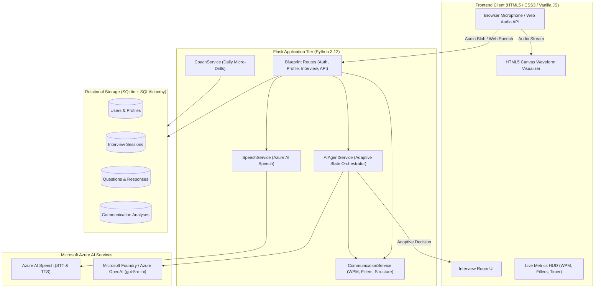
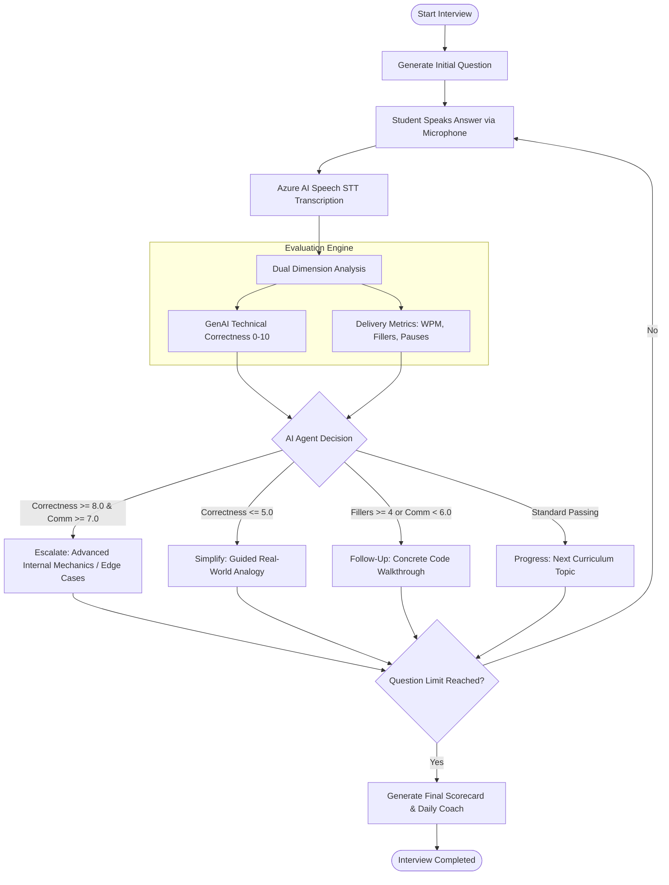

# 🏛️ PrepMate Architecture & System Design
**Chitkara University | AI-103 Group Project Documentation**

---

## 1. High-Level System Architecture

PrepMate follows a modular multi-tier architecture uniting speech processing, generative intelligence, agent decision orchestration, and relational persistence.

---

## 2. The Adaptive AI Agent Decision Loop

Rather than displaying a static predetermined questionnaire, PrepMate employs an **AI Agent state machine** that evaluates both candidate knowledge and vocal delivery to choose the optimal next step:

---

## 3. Communication Analysis Pipeline

The communication analyzer (`services/communication_service.py`) calculates speech delivery metrics:

1. **Speaking Rate (WPM):**
   $$\text{WPM} = \frac{\text{Spoken Word Count}}{\text{Elapsed Duration in Seconds} / 60}$$
   - *Target Professional Range:* 120 – 150 Words Per Minute.
2. **Filler Word Scanner:**
   - Evaluates regular expressions for speech hesitation tokens: `um`, `umm`, `uh`, `like`, `basically`, `actually`, `you know`, `literally`, `sort of`, `kind of`.
   - Returns itemized frequency dictionary for actionable coaching.
3. **Fluency Rating:**
   - Categorized as `Excellent`, `Good`, `Moderate`, or `Needs Improvement` based on filler ratio and WPM stability.
4. **Answer Structure Scoring:**
   - Detects linguistic anchors for **Definition/Premise**, **Explanation Mechanism**, **Example/Application**, and **Conclusion/Synthesis**.
